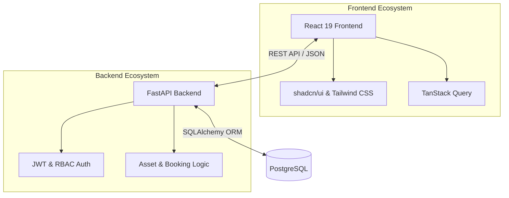

# AssetFlow: Enterprise Asset & Resource Management System

## Overall Vision
AssetFlow is a centralized ERP platform designed to simplify and digitize how organizations track, allocate, and maintain their physical assets and shared resources. By moving away from manual tracking inefficiencies like spreadsheets and paper logs, AssetFlow provides structured asset lifecycles, centralized resource booking, and real-time visibility into asset ownership, location, and condition.

## Problem Statement
Organizations need a structured way to:
- Maintain departments, asset categories, and an employee directory.
- Track assets through a flexible lifecycle (Available, Allocated, Reserved, Under Maintenance, Lost, Retired, Disposed).
- Allocate assets to employees/departments without double-allocation.
- Book shared/limited resources by time slot with overlap validation.
- Route maintenance requests through an approval workflow.
- Run scheduled audit cycles with auto-generated discrepancy reports.
- Surface overdue returns, bookings, and maintenance activity via notifications and KPI dashboards.

## User Roles & Basic Workflow
1. **Admin**: Sets up departments, asset categories, and promotes employees to Department Head or Asset Manager.
2. **Asset Manager**: Registers assets, approves transfers/maintenance/returns, and handles audit discrepancies.
3. **Department Head**: Approves allocation/transfer requests within their department and books resources on behalf of the department.
4. **Employee**: Views their allocated assets, books shared resources, raises maintenance requests, and initiates return/transfer requests.

### High-Level System Architecture

## Security Posture
AssetFlow implements strict Role-Based Access Control (RBAC) and JWT authentication to ensure data privacy and integrity. All API endpoints are secured, ensuring users can only access or modify data pertinent to their specific roles and departments.

## Navigation
- [Frontend Documentation](./frontend/README.md)
- [Backend Documentation](./backend/README.md)
